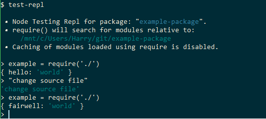

# test-repl

REPL designed to facilitate testing of packages by disabling caching of required files
and aligning the base directory with the project root.



## Installation

```shell
$ npm install -g  test-repl
```

# Usage

```shell
$ test-repl

 Node Testing Repl for package: "example-package".
 • require() will search for modules relative to:
     /path/to/packge
 • Caching of modules loaded using require is disabled.

>
```

Use in the same way as running ```$ node```.

### Command History

The history of commands is stored in a text file at `~/.node-test-repl-history`.
